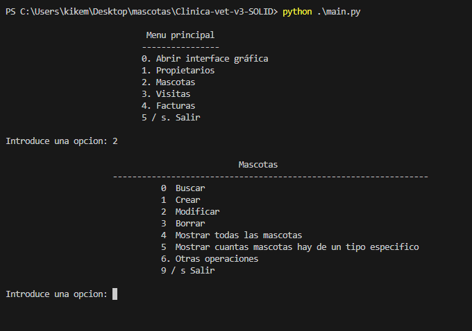
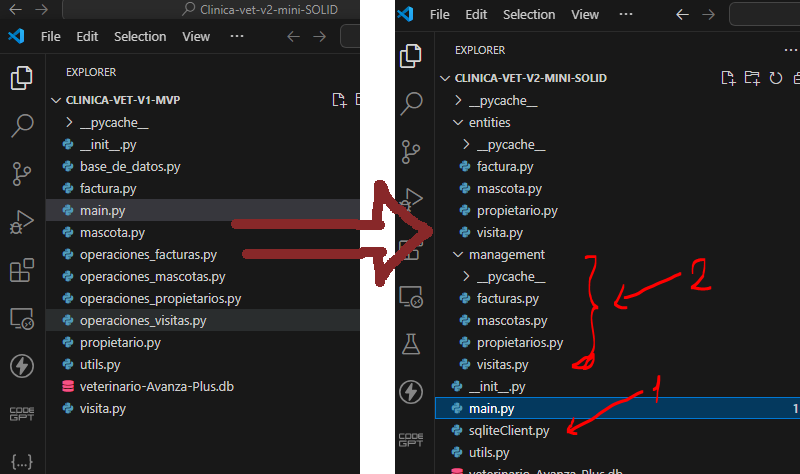

# ¿ Que es clinica veterinaria ?
Es una aplicación de consola para la gestión de una clínica veterinaria.

Es el programa final de escritorio del mejor curso jamás contado.

# Clinica-vet-v1-MVP

Prueba online: https://replit.com/@kikemadrigal/Clinica-veterinaria-avanza-MVP?v=1

Mínimo Viable Product (MVP), lo mínimo que se necesita para que funcione el programa.

# Clinica-vet-v2-SOLID

Prueba online: https://replit.com/@kikemadrigal/Clinica-veterinaria-SOLID?v=1

Que pasa si queremos implementar otro sistema gestor de bases de datos como mysql o queremos ponerle interface gráfica a la aplicación?

En la versión MVP no teníamos separación de responsabilidades o inversión de dependencias, te lo explico a oninuación.

Al utilizar estas técnicas vamos a hacer que nuestro código sea escalable y mantenible.

También hay que intentar seguir una aquitectura limpia que básicamente es crear 3 carpetas: 1 la UI (interface de usuario), 2 Controladores (que manejan la logica de la aplicación) y 3 Modelos (que manejan la logica de la base de datos).

La capa de casos de uso son unas clases que se ponen entre el controlador y el modelo, báscicamente para probar funcionalidades.

https://medium.com/@diego.coder/introducci%C3%B3n-a-las-clean-architectures-723fe9fe17fa

# ¿Que sonlos principios solid?

S: Single Responsibility Principle

O: Open/Closed Principle

L: Liskov Substitution Principle

I: Interface Segregation Principle

D: Dependency Inversion Principle

## Single Responsibility Principle

Ve al proyecto: Clinica-vet-v1-MVP-parte-2

La clase debe ser responsable de una sola tarea, no de varias.

Como podemos ver en nuestro proyecto MVP la conexión y el cursor de la base de datos aparece en los archivos de main.py, operaciones..py y base_de_datos.py

¿No crees que deberiamos de crear una clase (por ejemplo SqliteClient) que nos devolviera la conexión y el cursor cuando quisieramos? podríamos apartar la lógica de la base de datos del resto de la aplicación. 

¿No crees que deberiamos de crear una clase propietarios, mascotas, visitas y facturas que se inicializara con un objeto SqliteClient y que ahí sacaramos la conexión y el cursor?

Podríamos aprovechar las clases propietarios, mascotas, visitas pata tener una list con un montón de obejtos de propietarios, mascotas, visitas, facturas y ahí mismo hacer operaciones Create-Read-Update-Delete (CRUD), operaciones con api rest y operaciones con la lista misma.

Quiero decir:

## Open/Closed Principle

Las clases deben ser abiertas para extender y cerradas para modificar.

## Liskov Substitution Principle

Los objetos de una subclase deben ser reemplazables por sus superclases sin alterar la funcionalidad del programa.

## Interface Segregation Principle

Los clientes no deben ser forzados a dependir de interfaces que no utilizan.

## Dependency Inversion Principle

Depende de abstracciones, no de concretos.

El objeto sqliteClient es inyectado en el constructor de la clase PropietarioManagement, MascotaManagement, VisitaManagement y FacturasManagement.

# ¿Como se trabaja con tests?

Crea una carpeta llamada tests  dentro los archivos que comienzan con test_...

En nuestro caso tenemos un archivo llamado test_utils.py

Dentro del archivo crea una clase que empiece por Test, en nuestro caso TestUtils

Para crear un test debemos importar unittest y patch

Para ejecuta los test o pinchamos en ejecutar de vscode o escribimos en el terminal o cmd python -m unittest o python -m unittest tests.test_utils

    import unittest
    from unittest.mock import patch

    class TestUtils(unittest.TestCase):
        def test_check_empty(self):
            from src.utils.utils import check_empty
            assert check_empty("")
            assert check_empty(" ")
            assert not check_empty("a")
            assert not check_empty("a ")
            assert not check_empty(" a")

        #R ecorta un string a 10 caracters y si es menor lo rellena con espacios
        def test_formatear_cadena(self):
            from src.utils.utils import formatear_cadena
            # 1 .Preparamos los datos del test
            cadena_menor="a"*8
            cadena_mayor="a"*52
            # 2. Ejecutar lo que tiene que hacer el test
            #podemos envolver la ejecucion de la funcion con un assert.raises
            #with self.assertRaises(ValueError):
            resultado_menor=formatear_cadena(cadena_menor)
            #with self.assertRaises(ValueError):
            resultado_mayor=formatear_cadena(cadena_mayor)

            # 3. Comprobar el resultado
            self.assertEqual(len(resultado_menor), 10)
            self.assertEqual(len(resultado_mayor), 10)
    #Puesdes ejecutar el test en consola con: python -m unittest test_utils
    # o python -m unittest pero ejecutará todos los tests
    if __name__ == "__main__":
        unittest.main()

Recuerda: 

assert(calcula_media([3, 7, 5]) == 5.0)

.assertEqual(a, b): Verifica la igualdad de ambos valores.

.assertTrue(x): Verifica que el valor es True.

.assertFalse(x): Verifica que el valor es False.

.assertIs(a, b): Verifica que ambas variables son la misma (ver operador is).

.assertIsNone(x): Verifica que el valor es None.

.assertIn(a, b): Verifica que a pertenece al iterable b (ver operador in).

.assertIsInstance(a, b): Verifica que a es una instancia de b

.assertRaises(x): Verifica que se lanza una excepción.

# Fin

